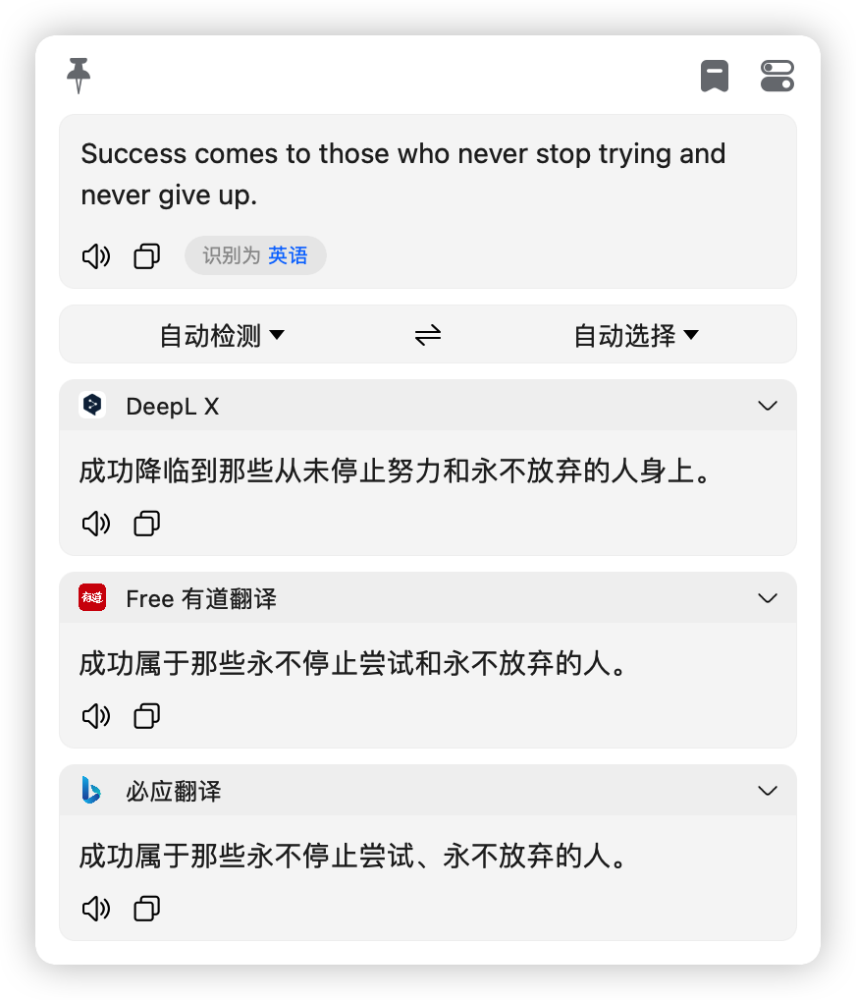

# 必应翻译

## 无需秘钥，可以直接在 bob 中进行工作，如果有一天它不工作了，请联系我进行修复！

> src 文件夹主要为 bob 用户开发，bob 是一款 macOS 上的翻译软件，bob 官网地址：[bob](https://bobtranslate.com/)
>
> 插件下载地址：[bob-plugin-free-bing-translate-v0.0.3.bobplugin](https://github.com/bilibili-ayang/bob-plugin-free-bing-translate/releases/download/v0.0.3/bob-plugin-free-bing-translate.bobplugin)

> server 文件夹是 node.js 服务器，可以自行改造后在任意场景下使用！

### bob 插件大合集:

> [chatGPT 插件(免秘钥，免翻)](https://github.com/bilibili-ayang/bob-plugin-free-chatgpt)

> [阿里翻译插件(免秘钥)](https://github.com/bilibili-ayang/bob-plugin-free-ali-translate)

> [搜狗翻译插件(免秘钥)](https://github.com/bilibili-ayang/bob-plugin-free-sougou-translate)

> [爱词霸翻译插件(免秘钥)](https://github.com/bilibili-ayang/bob-plugin-free-iciba-translate)

> [必应翻译插件(免秘钥)](https://github.com/bilibili-ayang/bob-plugin-free-bing-translate)

### 使用截图如下：

